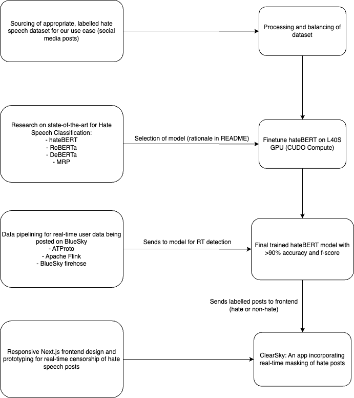

# Clearsky
Hate comments are a dime a dozen on sites such as X (formerly Twitter) and Bluesky (Twitter's cooler step-brother), and impressionable youths are susceptible to negative rhetoric, from celebrities to bot comments spreading discord. **Clearsky** filters out hateful comments in real-time, the perfect option to scroll your favourite content, whilst drowning out the noise of vitriol.

## Quick Setup Guide
**Requirements**: 
Python 3.11.X
Node v18 and above

For Mac/Linux:
```
chmod +x run.sh
./run.sh
```

For Windows:
```
./run.bat
```

## Solution
[hateBERT](https://arxiv.org/abs/2010.12472) is a 110M-parameter BERT model that outperforms classic transformer-based bidirectional encoders on detecting hate and abusive speech, having being further trained on 1 million posts from banned communities on Reddit. The pretrained hateBERT model contains just the bidirectional encoder, hence, we attached a feedforward neural network classifier head to it to perform the task of hate speech classification and censorship, initialised with random weights (to be finetuned on our dataset).

[A Curated Hate Speech Dataset](https://data.mendeley.com/datasets/9sxpkmm8xn/1) was used as our primary dataset for finetuning of hateBERT, with over 450,000 labelled sentences of hate and non-hate speech in a format that resembles social media posts such as Tweets. The dataset was cleaned and balanced before being used to finetune our hateBERT model using a L40S GPU on CUDO Compute with 48GB GDDR6 with ECC.

Our workflow is roughly as follows: 




## Considerations
1. Small - medium parameter model: such that we can further fine tune on our dataset within one night for the purposes of the hackathon.
2. Heavy emphasis on Transformer-based bidirectional encoders for global attention with deep understanding on semantic meaning behind full sentences, especially for posts that are sarcastic. Basic understanding on individual words like conventional word2vec models will not suffice.
3. Fast inference speed for real-time classification.

## Alternatives Base Models Considered
### 1. [RoBERTa](https://arxiv.org/abs/1907.11692) 
RoBERTa builds on BERT by training on larger corpora and using training strategies that make it more robust. This results in strong performance across a wide variety of tasks, with a proven baseline, making it a strong base model choice for any task that requires deep language understanding.

### 2. [DeBERTa](https://arxiv.org/abs/2006.03654) 
DeBERTa separates content and positional information, allowing the model to handle word positions more effectively. This leads to improved understanding of context, especially in nuanced language, critical for our use case. DeBERTa has also been shown to reach high macro-F1 scores on hate detection due to its disentangled attention and enhanced mask decoder. 

## Possible Extensions
1. Finetuning the roBERTa and DeBERTa models and comparing their evaluation metrics against the finetuned hateBERT model, such that we can consider aggregating the results for a more holistic representation of the sentence's semantic meaning.

2. Optimised hyperparameter tuning using [Optuna](https://optuna.org/), if compute and time constraints allow.

3. Integration of interpretability through [Masked Rationale Prediction (MRP)](https://aclanthology.org/2022.coling-1.577.pdf#:~:text=speech,and%20implicit%20hate%20speech%20detection) as an intermediary, so that the model's classifications of whether something is a hate speech or not can be explained clearly to the users.

## ATProto
ATProto is an open-source protocol built by the engineers over at Bluesky, which aims to democratise user data and provide access to all. We make use of Bluesky's own relay to quickly pull large volumes of user posts, as a proof of concept for Clearsky's ability to filter in real time. Posts gathered from the Bluesky relay (or Firehose) are not meaningfully sorted or categorised, and appear on the frontend in real time.

## Apache Flink (PyFlink)
To process real time data, a stream processing pipeline is required to quickly pre-process incoming data effectively and feed our ML model clean data for faster inference. Apache Flink was used to filter out "spammy" messages (less than 50 characters), non-English data and perform preliminary checks with a profanity filter. The data obtained from Bluesky's firehose is then cleaned and sent to the ML model to be processed. Uses the PyFlink library to link with Bluesky's Python support.

### Notes
Names, handles and profile photos of posts on Clearsky are kept anonymous to protect the identity of Bluesky users, regardless of the content of their posts. Clearsky is meant to be a tool to showcase the potential of real-time filtering and how social media platforms can work to improve their automated moderation tools.